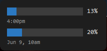
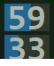
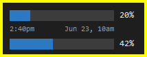

# Claude Usage Widget

A lightweight Win32 desktop widget (C++/WinAPI) that shows your **Claude.ai
rate‑limit usage** at a glance — the current 5‑hour session and 7‑day window,
with reset times — and falls back to **local Claude Code token usage** when
live limits aren't available.

| Full mode | Simple mode |
|-----------|-------------|
|  |  |

**Full mode** shows each limit as a progress bar with its whole‑number
percentage — session on top, week below — and the two reset times on the line
between the bars (session left, week right). **Simple mode** is a compact
two‑cell view of just the numbers. Switch between them by
**double‑clicking** the widget or via the right‑click menu.

---

## Claude Code alert border

The widget doubles as an at‑a‑glance status light for **Claude Code**: when a
session needs your input or has finished working, a **bright‑yellow blinking
border** appears around the widget.



- Driven by Claude Code lifecycle **hooks** — `Notification` (a session is
  asking) and `Stop` (a session finished work) light the border; both blink.
- Each session writes a small flag file into `%USERPROFILE%\.claude\widget-alerts\`;
  the widget polls that folder ~4×/second and aggregates across all sessions.
- **Click or tap** the widget to acknowledge and clear the border. It also
  clears automatically when you reply (`UserPromptSubmit`) or the session ends
  (`SessionEnd`). Stale flags (>2 h) are ignored.
- Installed by `setup.bat` (it runs `hooks/install_hooks.ps1`, which copies the
  bridge script to `~/.claude/hooks/` and merges the four events into
  `~/.claude/settings.json`).

---

## How it works

Claude.ai's usage numbers live behind your first‑party login, so the widget
can't fetch them directly. The data flows through four small pieces:

```
 ┌─────────────────────┐   fetch /usage      ┌──────────────────────┐
 │ Chrome extension    │  (first-party       │ claude.ai             │
 │ content.js + SW     │   cookies)          │ /api/.../usage        │
 └─────────┬───────────┘ ───────────────────►└──────────────────────┘
           │ Native Messaging
           ▼
 ┌─────────────────────┐  writes JSON   ┌────────────────────────────────────┐
 │ native_host/host.py │ ─────────────► │ %USERPROFILE%\.claude\             │
 └─────────────────────┘                │   widget_limits.json               │
                                        └──────────────┬─────────────────────┘
                                                       │ reads
                                                       ▼
 ┌──────────────────────────────┐  runs   ┌────────────────────────────────┐
 │ Claude_Usage.exe (main.cpp)  │ ──────► │ get_limits.py  →  pct | reset   │
 │  desktop widget              │         │ get_daily.py   →  local fallback│
 └──────────────────────────────┘         └────────────────────────────────┘
```

1. **Chrome extension** (`extension/`) — a content script runs on `claude.ai`
   and fetches `/api/organizations/{uuid}/usage` using your first‑party
   cookies. A service worker (`background.js`) uses `chrome.alarms` to poll
   every minute, so updates keep flowing even when the tab is backgrounded.
2. **Native messaging host** (`native_host/host.py`) — receives the usage
   payload from the extension and writes it to
   `%USERPROFILE%\.claude\widget_limits.json`.
3. **`get_limits.py`** — read by the widget; emits
   `session_pct|session_reset|week_pct|week_reset`, or `FALLBACK` if the JSON
   is missing or stale (>1 h old).
4. **`get_daily.py`** — fallback source. Scans
   `~/.claude/projects/**/*.jsonl` (Claude Code's local logs) for the last
   30 days and reports per‑day token counts and per‑model totals.
5. **The widget** (`main.cpp`) renders the bars and refreshes on a timer.

---

## Requirements

- Windows 10/11
- Python 3 on `PATH` (for the `get_*.py` helpers and the native host)
- Google Chrome (for the extension that pulls live limits)
- To build from source: CLion's bundled MinGW GCC, or any `g++` with C++20

---

## Install (prebuilt)

1. Unzip `Claude_Usage_Widget.zip`.
2. Run **`setup.bat`**. It will:
   - copy `get_limits.py` / `get_daily.py` next to the `.exe`,
   - generate `native_host/com.claude.widget.json` with the correct absolute
     path,
   - register the native messaging host under
     `HKCU\Software\Google\Chrome\NativeMessagingHosts`, and
   - install the Claude Code alert hooks (`hooks/install_hooks.ps1`).
3. Load the Chrome extension:
   `chrome://extensions` → enable **Developer mode** → **Load unpacked** →
   select the `extension/` folder.
4. Start the widget: `cmake-build-debug\Claude_Usage.exe`.

> The extension ID is pinned to `dfjhnnbfnnfhajbhcgikibbfhbdcampf` by the
> `"key"` in `extension/manifest.json`, so it stays the same on every machine
> and matches the `allowed_origins` that `setup.bat` writes. If you ever
> regenerate that key, update the ID in `setup.bat` (the `allowed_origins`
> line) to match.

---

## Build from source

```bash
g++ -std=gnu++20 -o cmake-build-debug/Claude_Usage.exe main.cpp \
    -luser32 -lgdi32 -mwindows
```

In this repo, prefer the **`/clion-cpp`** workflow (handles the MinGW `PATH`
fix and a detached launch) and **`/pack`** to rebuild
`Claude_Usage_Widget.zip`. See `build.bat` for the exact compiler invocation.

---

## Using the widget

- **Drag** anywhere to move it; its position is remembered between runs.
- **Click / tap** the widget to acknowledge and clear a Claude Code alert
  border (see above).
- **Double‑click** to toggle between full and Simple mode. Simple mode anchors
  to the lower‑left corner of the full widget, so the bottom‑left stays put as
  the widget shrinks or grows.
- **Right‑click** for the menu:
  - **Refresh now** — re‑read the usage data immediately.
  - **Opacity** — pick a transparency level (25–100%).
  - **More info…** — an info popup with full reset details.
  - **Simple mode** — same toggle as double‑click (shows a ✓ when active).
  - **Exit**.

State is persisted under `%USERPROFILE%\.claude\` (window position, opacity,
`widget_simple.txt` for the Simple‑mode toggle, and `widget-alerts\` for the
Claude Code alert flags).

---

## Project layout

| Path | Purpose |
|------|---------|
| `main.cpp` | The C++/WinAPI widget (rendering, menu, persistence) |
| `get_limits.py` | Live limits from `widget_limits.json` → widget |
| `get_daily.py` | Local Claude Code token usage (fallback) |
| `extension/` | Chrome extension (`manifest.json`, `background.js`, `content.js`) |
| `native_host/` | Native messaging bridge (`host.py`, `host.bat`) |
| `hooks/` | Claude Code alert hooks (`widget_signal.py`/`.bat`, `install_hooks.ps1`) |
| `setup.bat` | One‑shot installer (copies files, writes manifest, registers host, installs hooks) |
| `build.bat` | Reference g++ build command |
| `Claude_Usage_Widget.zip` | Packaged, ready‑to‑deploy bundle |

---

## Notes

- `native_host/com.claude.widget.json` is **machine‑specific** (it embeds an
  absolute path) and is regenerated by `setup.bat`; it is intentionally left
  out of the distributed zip.
- If live limits stop updating, confirm the Chrome extension is loaded and a
  `claude.ai` tab is open — the service worker only fetches when at least one
  is present.
